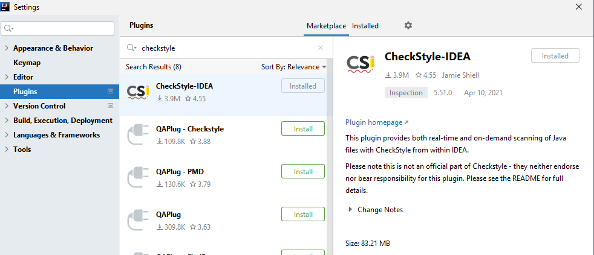

# How to install code styles tools

## Table of content
* [Configuration Checkstyle for IntelliJ IDEA](Configuration_Checkstyle_for_IntelliJ_IDEA)
* [Configuration Code Style for IntelliJ IDEA](Configuration_Code_Style_for_IntelliJ_IDEA)

## Configuration Checkstyle for IntelliJ IDEA
We will use the following config: https://raw.githubusercontent.com/DmitryKhodakovsky/epam-training-center-code-checkers-configurations/main/checkstyle/checkstyle.xml. 
Settings for pom.xml can be taken from this repo pom.xml

In IntelliJ IDEA I use the following plugin: https://plugins.jetbrains.com/plugin/1065-checkstyle-idea

paste mentioned URL: https://raw.githubusercontent.com/DmitryKhodakovsky/epam-training-center-code-checkers-configurations/main/checkstyle/checkstyle.xml

Check imported Configuration file

Sometimes run checks

## Configuration Code Style for IntelliJ IDEA

Copy content of the file https://raw.githubusercontent.com/DmitryKhodakovsky/epam-training-center-code-checkers-configurations/main/formatter/code_style.xml to your project and set up path to it in the settings 

